# OpenCode 集成架构文档

> 将 opencode 作为编程 Agent 后端接入 Agent 开发平台（参考 Coze 架构）

---

## 目录

1. [背景与目标](#1-背景与目标)
2. [系统总体架构](#2-系统总体架构)
3. [沙箱隔离方案](#3-沙箱隔离方案)
4. [核心交互时序](#4-核心交互时序)
5. [OpenCode Agent 内部流程](#5-opencode-agent-内部流程)
6. [数据模型设计](#6-数据模型设计)
7. [SSE 事件流详解](#7-sse-事件流详解)
8. [前端步骤日志渲染](#8-前端步骤日志渲染)
9. [Java 后端网关设计](#9-java-后端网关设计)
10. [权限策略引擎](#10-权限策略引擎)
11. [Skill Creator 集成](#11-skill-creator-集成)
12. [多 LLM 提供商支持](#12-多-llm-提供商支持)
13. [安全架构](#13-安全架构)
14. [关键源文件参考](#14-关键源文件参考)
15. [实施路线图](#15-实施路线图)

---

## 1. 背景与目标

### 平台现状

- Agent 开发平台参考 **Coze** 构建，提供 Agent 编排、技能管理、工作流等能力
- 技术栈：**Java 后端**（Spring Boot）+ **Vue/React 前端**
- 需要引入一个**独立编程工作台**：用户可以在其中与 AI 编程助手交互，生成代码、执行命令、管理文件

### 为什么选择 opencode

opencode 是完全开源、不绑定特定 AI 提供商的 AI 编程助手，提供：

- 完整的无头 API 服务器（`opencode serve`，端口 4096）
- 基于 Hono 框架的 REST API + SSE 实时事件流
- 完整的 Agent 循环：用户输入 → LLM 推理 → 工具调用 → 结果 → 循环
- 内置工具集：文件读写、Shell 执行、代码搜索、网页获取等
- 多 LLM 提供商支持：Anthropic、OpenAI、Google、Azure 等 18+ 提供商
- SKILL.md 技能系统：可扩展的自定义 AI 技能

### 集成目标

| 需求 | opencode 提供的能力 |
|------|-------------------|
| 代码生成与编辑 | Agent 循环 + edit/write 工具 |
| 工具/命令执行 | bash/glob/grep/fetch 等工具 |
| 多轮对话管理 | Session 会话系统 + SQLite 持久化 |
| 多 LLM 提供商 | Provider 抽象层，18+ 提供商 |
| Skill Creator | SKILL.md 技能文件系统 |
| 沙箱文件隔离 | Docker 容器 + 独立 /workspace 目录 |
| 实时步骤日志 | SSE 事件流（message.part.updated 等） |

---

## 2. 系统总体架构

### 2.1 分层架构图

```
┌─────────────────────────────────────────────────────────────────────────────┐
│                            用户浏览器 (Vue/React)                            │
│  ┌─────────────┐  ┌─────────────┐  ┌──────────┐  ┌────────┐  ┌──────────┐ │
│  │  对话面板     │  │  步骤日志    │  │  文件树   │  │ 技能编辑│  │ 模型选择  │ │
│  └──────┬──────┘  └──────┬──────┘  └────┬─────┘  └───┬────┘  └────┬─────┘ │
└─────────┼────────────────┼──────────────┼────────────┼───────────┼────────┘
          │   WebSocket (双向)             │  HTTP REST │           │
          ▼                               ▼            ▼           ▼
┌─────────────────────────────────────────────────────────────────────────────┐
│                        Java 后端 (Spring Boot)                               │
│                                                                             │
│  ┌───────────┐  ┌──────────────┐  ┌──────────────┐  ┌───────────────────┐  │
│  │ 用户认证    │  │ 沙箱管理器    │  │ SSE→WS 桥接  │  │ OpenCode API 客户端│  │
│  │ (JWT/SSO) │  │ (生命周期)    │  │ (事件分发)    │  │ (Spring WebClient)│  │
│  └───────────┘  └──────┬───────┘  └──────┬───────┘  └────────┬──────────┘  │
│                        │                 │                    │             │
│  ┌─────────────────────┴─────────────────┴────────────────────┘             │
│  │ 会话/沙箱映射层 (DB: sandbox_instance + session_mapping)                   │
│  └─────────────────────┬─────────────────────────────────────              │
└────────────────────────┼────────────────────────────────────────────────────┘
                         │  HTTP REST + SSE (per sandbox)
                         ▼
┌─────────────────────────────────────────────────────────────────────────────┐
│                        Docker 沙箱集群                                       │
│                                                                             │
│  ┌─────────────────┐  ┌─────────────────┐  ┌─────────────────┐            │
│  │ Sandbox-UserA   │  │ Sandbox-UserB   │  │ Sandbox-UserC   │   ...      │
│  │ ┌─────────────┐ │  │ ┌─────────────┐ │  │ ┌─────────────┐ │            │
│  │ │opencode     │ │  │ │opencode     │ │  │ │opencode     │ │            │
│  │ │serve:4096   │ │  │ │serve:4096   │ │  │ │serve:4096   │ │            │
│  │ ├─────────────┤ │  │ ├─────────────┤ │  │ ├─────────────┤ │            │
│  │ │/workspace   │ │  │ │/workspace   │ │  │ │/workspace   │ │            │
│  │ │(持久卷)      │ │  │ │(持久卷)      │ │  │ │(持久卷)      │ │            │
│  │ └─────────────┘ │  │ └─────────────┘ │  │ └─────────────┘ │            │
│  └─────────────────┘  └─────────────────┘  └─────────────────┘            │
└─────────────────────────────────────────────────────────────────────────────┘
```

### 2.2 组件关系图

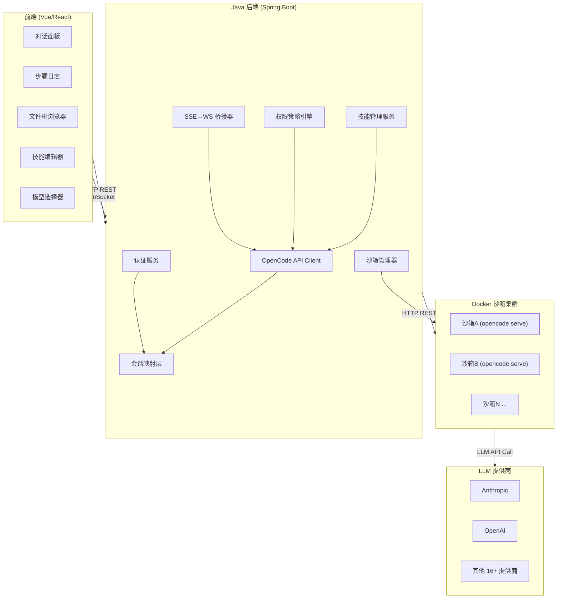

### 2.3 核心设计原则

| 原则 | 说明 |
|------|------|
| **微服务解耦** | opencode 作为独立服务，Java 后端通过 HTTP API 调用 |
| **异步 prompt** | 使用 `prompt_async` 避免长连接超时，通过 SSE 获取进度 |
| **网关代理** | Java 后端作为所有请求的代理，opencode 不直接对外暴露 |
| **容器隔离** | 每个用户/任务运行在独立 Docker 容器，文件系统天然隔离 |
| **事件驱动** | 所有实时状态变更通过 SSE→WebSocket 事件流推送 |

---

## 3. 沙箱隔离方案

### 3.1 沙箱生命周期状态图

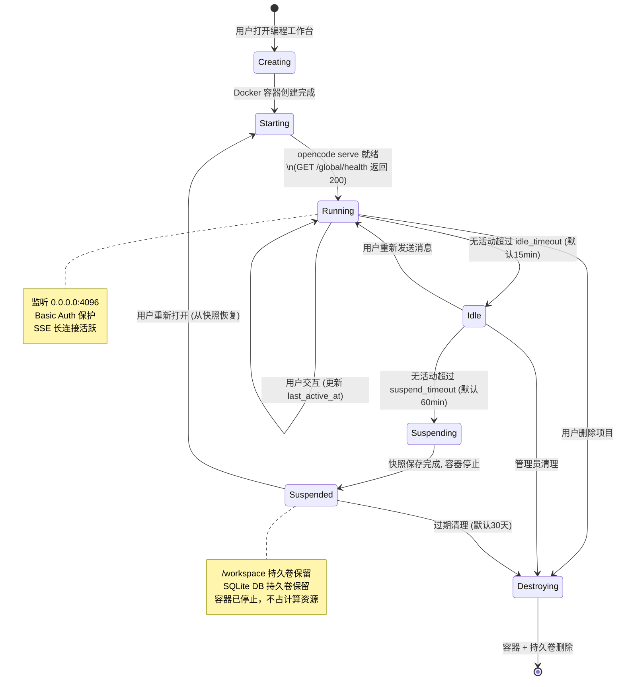

### 3.2 容器内部架构

```
┌─────────────────── Docker Container ──────────────────────┐
│                                                           │
│  环境变量 (启动时注入):                                     │
│    OPENCODE_SERVER_PASSWORD = <每沙箱唯一随机密码>           │
│    ANTHROPIC_API_KEY        = <平台统一管理>                │
│    OPENAI_API_KEY           = <平台统一管理>                │
│    GOOGLE_GENERATIVE_AI_API_KEY = <平台统一管理>            │
│                                                           │
│  ┌───────────────────────────────────────────────────┐    │
│  │  opencode serve --port 4096 --hostname 0.0.0.0    │    │
│  │                                                   │    │
│  │  ┌────────────┐  ┌──────────┐  ┌──────────────┐  │    │
│  │  │  Hono API  │  │ SSE 事件  │  │  Agent 循环   │  │    │
│  │  │  REST 路由  │  │  Stream  │  │ LLM + Tools  │  │    │
│  │  └────────────┘  └──────────┘  └──────────────┘  │    │
│  │                                                   │    │
│  │  内置工具: bash, edit, write, read,               │    │
│  │           glob, grep, fetch, task, ...           │    │
│  │                                                   │    │
│  │  技能系统: /workspace/.opencode/skills/           │    │
│  │  权限配置: edit=allow, bash=allow (沙箱内安全)     │    │
│  └───────────────────────────────────────────────────┘    │
│                                                           │
│  持久卷挂载:                                               │
│    /workspace          → pvc-user-{id}-workspace          │
│    ~/.local/share/opencode → pvc-user-{id}-data           │
│                                                           │
│  资源限制:                                                 │
│    CPU: 2 cores    Memory: 4GB    Disk: 10GB              │
│    Network: 仅允许访问 LLM API 域名 + 内部网络             │
│                                                           │
│  对外暴露: 仅 TCP 4096 → Java 后端内网                      │
└───────────────────────────────────────────────────────────┘
```

### 3.3 数据持久化策略

| 数据 | 持久卷 | 恢复方式 |
|------|--------|---------|
| 用户代码文件 | `/workspace` 挂载独立 PVC | 容器重启自动恢复 |
| 会话历史 (SQLite) | `~/.local/share/opencode` 挂载独立 PVC | 容器重启自动恢复 |
| 技能文件 | `/workspace/.opencode/skills/` 随代码一起持久化 | 随 workspace PVC 恢复 |

---

## 4. 核心交互时序

### 4.1 用户发送消息完整流程

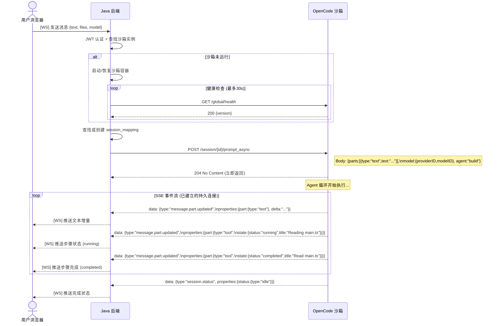

### 4.2 沙箱创建与 SSE 连接建立

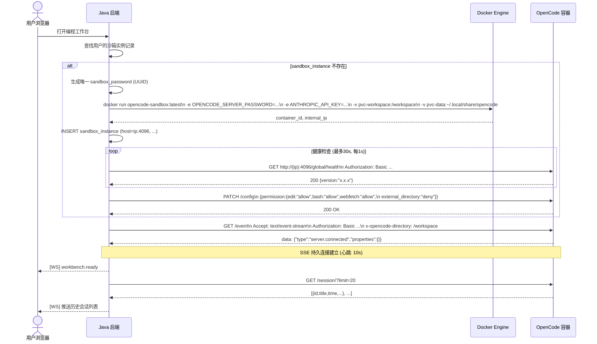

### 4.3 权限请求处理

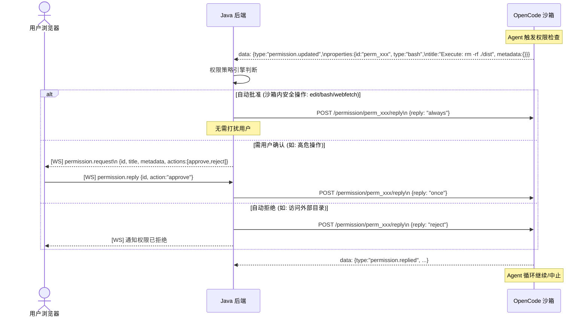

---

## 5. OpenCode Agent 内部流程

### 5.1 Agent 执行主循环

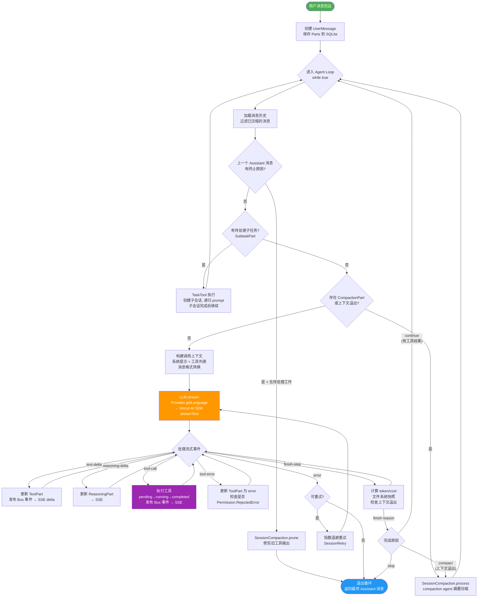

### 5.2 工具执行状态机

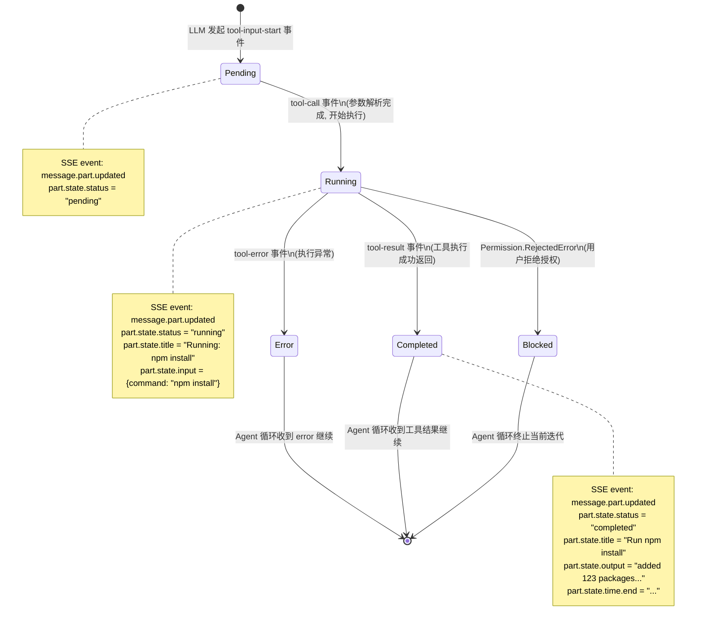

### 5.3 内置工具集

| 工具 ID | 功能 | 沙箱内权限 |
|---------|------|----------|
| `bash` | 执行 shell 命令 | auto-allow |
| `edit` | 编辑文件（精确替换） | auto-allow |
| `write` | 创建/覆写文件 | auto-allow |
| `read` | 读取文件内容 | auto-allow |
| `glob` | 按模式搜索文件 | auto-allow |
| `grep` | 搜索文件内容 | auto-allow |
| `fetch` | 获取网页内容 | auto-allow |
| `task` | 创建子 Agent 任务 | auto-allow |
| `webSearch` | 搜索引擎查询 | auto-allow |
| `codeSearch` | 代码语义搜索 | auto-allow |
| `todoWrite` | 更新 Todo 列表 | auto-allow |
| `applyPatch` | 应用 unified diff patch | auto-allow |

---

## 6. 数据模型设计

### 6.1 平台侧数据库 ER 图

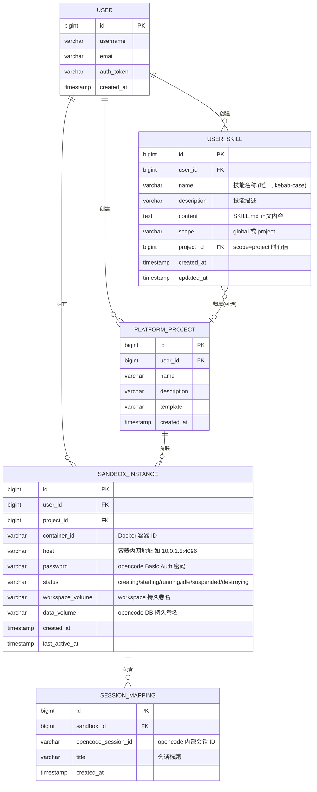

### 6.2 OpenCode 内部数据模型（只读参考）

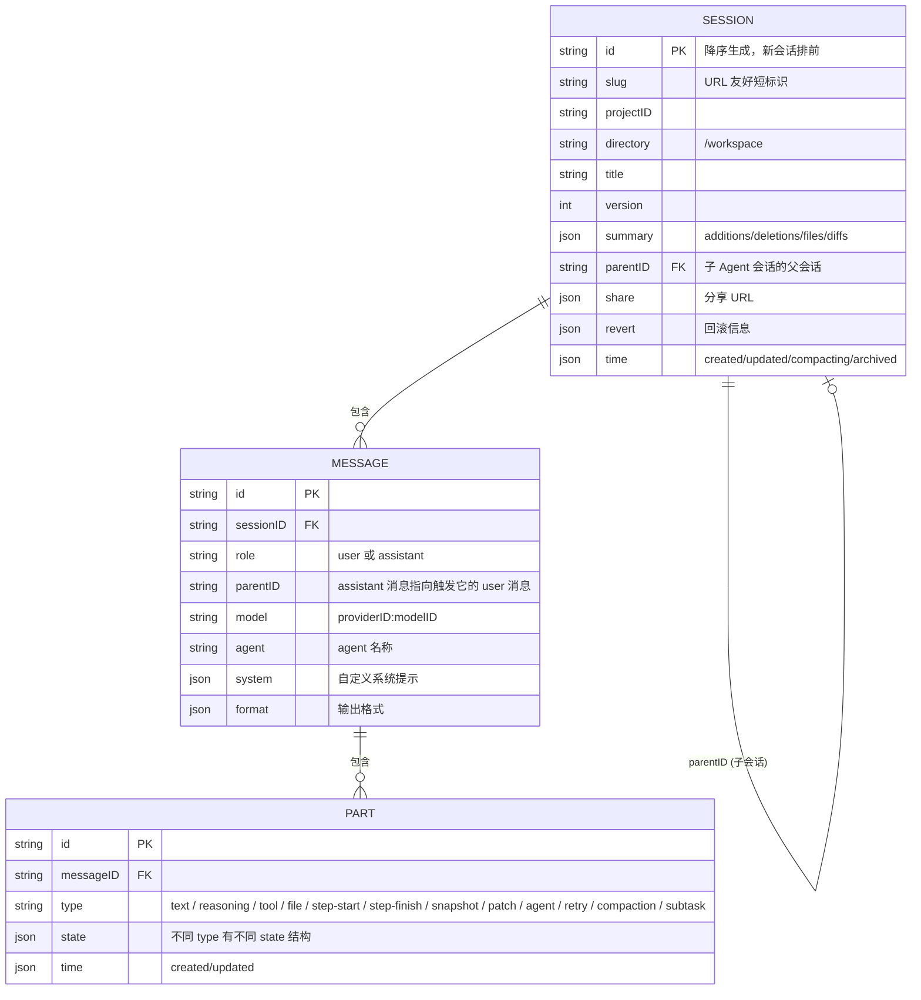

---

## 7. SSE 事件流详解

### 7.1 连接与格式

```
连接: GET http://{sandbox_host}/event
认证: Authorization: Basic base64(opencode:{password})
目录: x-opencode-directory: /workspace

SSE 帧格式:
  data: {"type":"<event_type>","properties":{...}}\n\n

心跳 (每10秒，防止代理超时):
  data: {"type":"server.heartbeat","properties":{}}\n\n

连接建立后立即收到:
  data: {"type":"server.connected","properties":{}}\n\n
```

### 7.2 事件分类树

```
server.*
├── server.connected          连接建立
├── server.heartbeat          心跳 (10s/次)
└── server.instance.disposed  实例销毁

session.*
├── session.created           新会话创建
├── session.updated           会话元数据更新 (标题/摘要等)
├── session.deleted           会话删除
├── session.status            状态变更 {type: "busy"|"idle"|"retry"}
├── session.error             会话错误 {error}
├── session.compacted         上下文压缩完成
└── session.diff              文件变更 (patch 列表)

message.*
├── message.updated           消息创建或更新
├── message.removed           消息删除
├── message.part.updated      Part 更新 (最频繁，含 delta)
└── message.part.removed      Part 删除

permission.*
├── permission.updated        权限请求产生 (等待回复)
└── permission.replied        权限请求已回复

todo.*
└── todo.updated              Todo 列表更新

file.*
├── file.edited               文件被编辑
└── file.watcher.updated      文件监视器变更通知
```

### 7.3 关键 Payload 示例

**文本流式输出 (message.part.updated)**
```json
{
  "type": "message.part.updated",
  "properties": {
    "sessionID": "sess_01jx...",
    "messageID": "msg_01jx...",
    "part": {
      "id": "part_01jx...",
      "type": "text",
      "state": { "text": "完整累积文本..." },
      "time": { "created": "2026-03-24T10:00:00Z" }
    },
    "delta": "增量追加的字符"
  }
}
```

**工具执行 running (message.part.updated)**
```json
{
  "type": "message.part.updated",
  "properties": {
    "sessionID": "sess_01jx...",
    "messageID": "msg_01jx...",
    "part": {
      "id": "part_01jx...",
      "type": "tool",
      "state": {
        "status": "running",
        "tool": "bash",
        "title": "Running: npm test",
        "input": { "command": "npm test" },
        "time": { "start": "2026-03-24T10:00:01Z" }
      }
    }
  }
}
```

**工具执行 completed (message.part.updated)**
```json
{
  "type": "message.part.updated",
  "properties": {
    "part": {
      "type": "tool",
      "state": {
        "status": "completed",
        "tool": "bash",
        "title": "Run npm test",
        "output": "✓ 42 tests passed",
        "time": { "start": "...", "end": "..." }
      }
    }
  }
}
```

**会话状态变更 (session.status)**
```json
{
  "type": "session.status",
  "properties": {
    "sessionID": "sess_01jx...",
    "status": { "type": "busy" }
  }
}
```

**权限请求 (permission.updated)**
```json
{
  "type": "permission.updated",
  "properties": {
    "id": "perm_01jx...",
    "sessionID": "sess_01jx...",
    "type": "bash",
    "title": "Execute: rm -rf ./dist",
    "metadata": { "command": "rm -rf ./dist" },
    "time": { "created": "..." }
  }
}
```

### 7.4 SSE→WebSocket 桥接架构

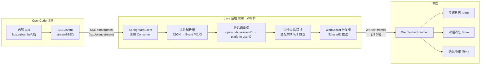

---

## 8. 前端步骤日志渲染

### 8.1 事件 → UI 映射

| SSE 事件 / Part 类型 | UI 渲染 | 状态图标 |
|---|---|---|
| `part.type="text"` + `delta` | 逐字追加 AI 回复（Markdown 渲染） | — |
| `part.type="reasoning"` | "思考中..." 可折叠推理过程 | 🧠 |
| `part.type="tool"` + `status="pending"` | 步骤行出现："准备: {工具名}" | ⏳ |
| `part.type="tool"` + `status="running"` | 旋转 + `state.title` 显示（如 "Running: npm test"） | 🔄 |
| `part.type="tool"` + `status="completed"` | 勾选 + `state.title` + 耗时 | ✅ |
| `part.type="tool"` + `status="error"` | 红叉 + `state.error` | ❌ |
| `part.type="step-start"` | 创建新的可折叠步骤组（Step N） | 📂 |
| `part.type="step-finish"` | 关闭步骤组，显示 token/费用摘要 | 📊 |
| `part.type="patch"` | "修改了 N 个文件" + 文件列表 | 📝 |
| `session.status` = `"busy"` | 全局旋转指示器："Agent 工作中..." | 🔄 |
| `session.status` = `"idle"` | 全局完成指示器 | ✅ |
| `session.status` = `"retry"` | "重试中 (第N次)..." + 倒计时 | ⏱️ |
| `permission.updated` | 暂停：显示权限确认卡片 | ⚠️ |

> **优先级**：展示时优先使用 `state.title`（人类可读描述），其次用工具 ID 映射表。

### 8.2 工具名称显示映射

| 工具 ID | 中文显示名 |
|--------|----------|
| `bash` | 执行命令 |
| `edit` | 编辑文件 |
| `write` | 创建文件 |
| `read` | 读取文件 |
| `glob` | 搜索文件 |
| `grep` | 搜索内容 |
| `fetch` | 获取网页 |
| `task` | 子任务 |
| `todoWrite` | 更新计划 |
| `webSearch` | 搜索网络 |
| `mcp__*` | MCP: {名称} |
| `skill__*` | 技能: {名称} |

### 8.3 步骤日志 UI 结构

```
┌─ 步骤日志 ───────────────────────────────────┐
│                                              │
│  ▼ Step 1                           [折叠▽]  │
│    ✅ 更新计划                                │
│    ✅ 更新计划                                │
│    ⚠️  更新计划 (需要确认)                    │
│    ✅ 更新计划                                │
│                                              │
│  ▼ Step 2                           [折叠▽]  │
│    ✅ 创建文件 /workspace/scripts/analyze.py  │
│    ✅ 创建文件 /workspace/SKILL.md            │
│                                              │
│  ▼ Step 3                           [折叠▽]  │
│    ✅ 执行命令 python analyze.py "..."        │
│    ✅ 执行命令 python analyze.py -t 第一段... │
│    ✅ 执行命令 python analyze.py -t 这是一段  │
│    ✅ 执行命令 python analyze.py "短文本。"   │
│                                              │
│  ▼ Step 4 (进行中)                  [展开▷]  │
│    ✅ 更新计划                                │
│    ✅ 执行命令 ls /workspace/                 │
│    ✅ 打包技能                                │
│    🔄 执行命令 ls -lh /workspace/...         │
│                                              │
└──────────────────────────────────────────────┘

渲染规则:
  step-start Part → 创建新的 Step N 折叠区域
  tool Part (running) → 🔄 动画行
  tool Part (completed) → ✅ 静态行 + 耗时
  tool Part (error) → ❌ 错误行
  step-finish Part → 关闭区域, 显示摘要
  patch Part → "修改了 N 个文件" 展开行
```

### 8.4 文本流式渲染逻辑

```
收到 message.part.updated (type=text):
  1. 按 part.id 查找/创建 buffer
  2. buffer += event.properties.delta
  3. 用 Markdown 渲染器重新渲染 buffer（debounce 16ms）

注意: state.text 是累积全文，delta 是增量。
      优先用 delta 做流式追加（性能好），
      state.text 用于断线重连后的状态恢复。
```

---

## 9. Java 后端网关设计

### 9.1 OpenCode API 调用清单

| 操作 | OpenCode API | HTTP 方法 | 关键参数 |
|------|-------------|----------|---------|
| 新建会话 | `/session/` | POST | `{title?, parentID?}` |
| 列出会话 | `/session/` | GET | `limit, before (cursor)` |
| 获取会话 | `/session/{id}` | GET | — |
| 删除会话 | `/session/{id}` | DELETE | — |
| 更新会话 | `/session/{id}` | PATCH | `{title?, archivedAt?}` |
| 发送消息（异步） | `/session/{id}/prompt_async` | POST | `{parts, model?, agent?}` |
| 发送消息（同步） | `/session/{id}/message` | POST | 同上（长连接等待完成） |
| 获取消息历史 | `/session/{id}/message` | GET | `limit, before` |
| 取消执行 | `/session/{id}/abort` | POST | — |
| 分支会话 | `/session/{id}/fork` | POST | `{messageID?}` |
| 文件差异 | `/session/{id}/diff` | GET | `messageID` |
| 回滚更改 | `/session/{id}/revert` | POST | `{messageID}` |
| 恢复回滚 | `/session/{id}/unrevert` | POST | — |
| 订阅事件 | `/event` | GET (SSE) | Header: x-opencode-directory |
| 浏览文件树 | `/file` | GET | `path` |
| 读取文件 | `/file/content` | GET | `path` |
| Git 状态 | `/file/status` | GET | — |
| 搜索文件名 | `/find/file` | GET | `query` |
| 搜索代码 | `/find` | GET | `pattern` |
| 列出提供商 | `/provider` | GET | — |
| 列出技能 | `/skill` | GET | — |
| 更新配置 | `/config` | PATCH | `{permission?, agent?, ...}` |
| 回复权限 | `/permission/{id}/reply` | POST | `{reply: "once"\|"always"\|"reject"}` |
| 回复问题 | `/question/{id}/reply` | POST | `{answers: [...]}` |
| 健康检查 | `/global/health` | GET | — |

### 9.2 请求代理流程

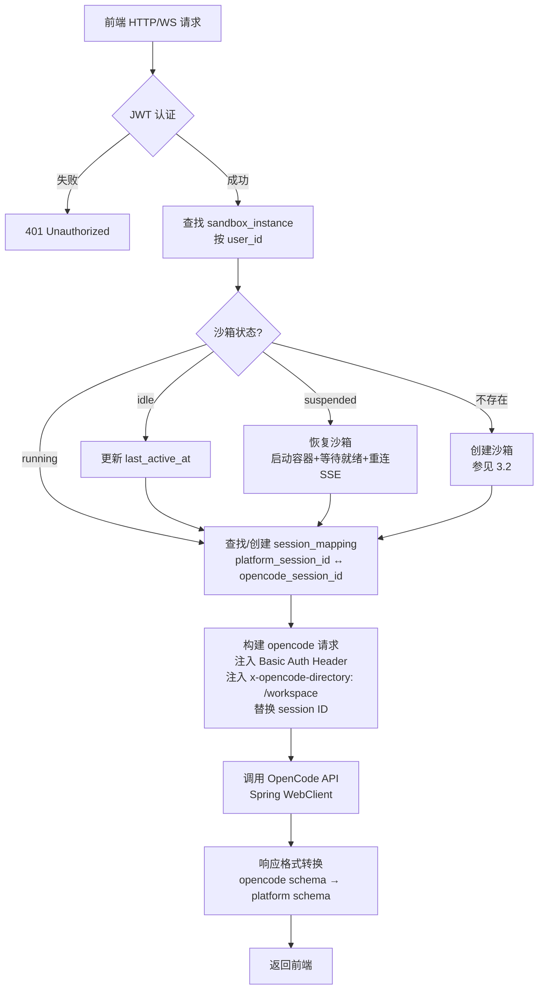

### 9.3 所有请求的公共 Header

```
Authorization: Basic base64("opencode:{sandbox_password}")
x-opencode-directory: /workspace
Content-Type: application/json
```

---

## 10. 权限策略引擎

### 10.1 决策流程

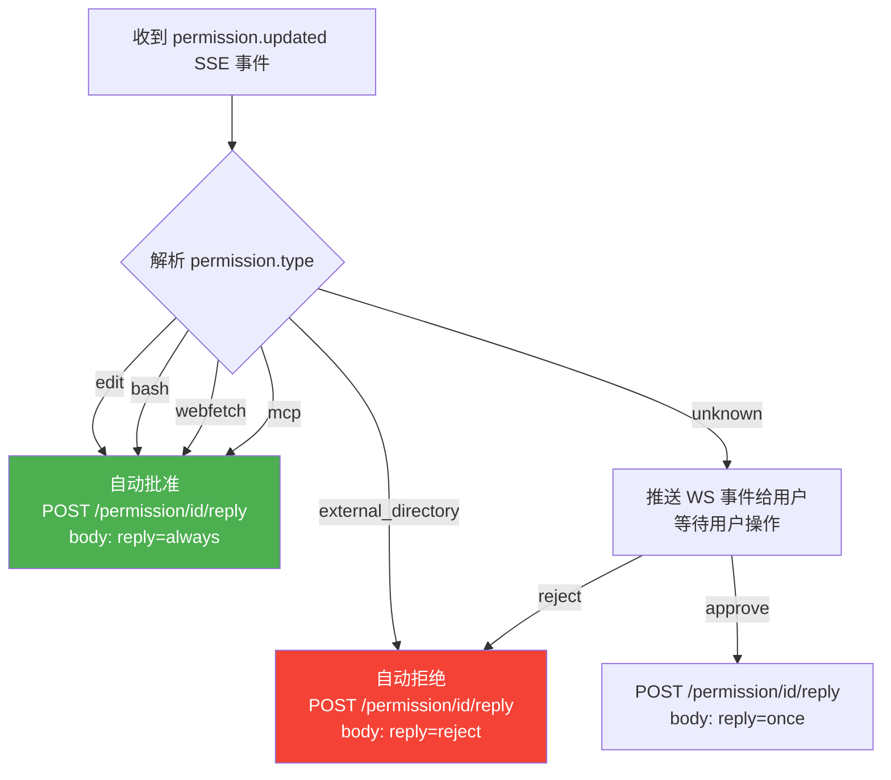

### 10.2 沙箱初始配置

在沙箱容器就绪后立即执行（通过 `PATCH /config`）：

```json
{
  "permission": {
    "edit": "allow",
    "bash": "allow",
    "webfetch": "allow",
    "mcp": "allow",
    "external_directory": "deny"
  }
}
```

> 沙箱容器已天然隔离，容器内所有文件操作和命令执行均在 `/workspace` 范围内，可安全自动批准。唯一需要拒绝的是尝试访问 `/workspace` 之外的路径。

---

## 11. Skill Creator 集成

### 11.1 技能创建流程

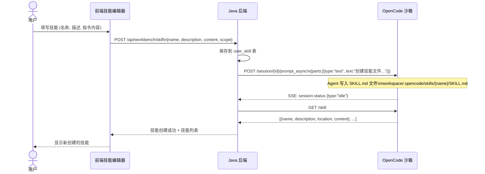

### 11.2 SKILL.md 文件格式

```markdown
---
name: text-statistics
description: 文本统计技能，分析中文文本的字数、段落数、首句摘要
---

当用户要求分析文本时，请执行以下步骤：

1. **统计总字数**：逐字计数（中文每个汉字算1字）
2. **统计段落数**：以空行作为段落分隔符
3. **提取首句摘要**：取第一个句号/问号/感叹号前的内容
4. **输出格式化报告**：
   - 总字数: {N} 字
   - 段落数: {N} 段
   - 首句摘要: {文字}

输出时使用清晰的 Markdown 格式。
```

### 11.3 技能文件发现路径（优先级从高到低）

```
1. /workspace/.opencode/skills/{name}/SKILL.md   项目级（推荐）
2. ~/.opencode/skills/{name}/SKILL.md             用户级
3. ~/.claude/skills/{name}/SKILL.md               兼容 Claude Code
4. config.skills.paths 配置的自定义路径
5. config.skills.urls 配置的远程注册中心 URL
```

### 11.4 共享技能注册中心（可选）

平台可搭建中心化技能仓库，供所有用户共享：

```
HTTP 服务暴露:
  GET /index.json
  → {"skills": [{"name": "text-statistics", "files": ["SKILL.md"]}, ...]}

  GET /{skill-name}/SKILL.md
  → skill 文件内容

配置 opencode 拉取:
  PATCH /config
  {"skills": {"urls": ["https://skills.your-platform.com/"]}}
```

---

## 12. 多 LLM 提供商支持

### 12.1 模型选择流程

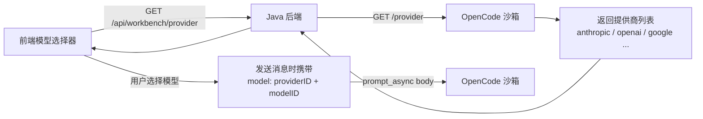

### 12.2 支持的主要提供商

opencode 内置支持（通过 Vercel AI SDK）：

| 提供商 ID | 名称 | 环境变量 |
|----------|------|---------|
| `anthropic` | Anthropic Claude | `ANTHROPIC_API_KEY` |
| `openai` | OpenAI GPT | `OPENAI_API_KEY` |
| `google` | Google Gemini | `GOOGLE_GENERATIVE_AI_API_KEY` |
| `amazon-bedrock` | AWS Bedrock | `AWS_ACCESS_KEY_ID` 等 |
| `azure` | Azure OpenAI | `AZURE_API_KEY` 等 |
| `openrouter` | OpenRouter | `OPENROUTER_API_KEY` |
| `github-copilot` | GitHub Copilot | OAuth 流程 |
| `xai` | xAI Grok | `XAI_API_KEY` |

### 12.3 API Key 管理方式

```
方式一: 平台统一管理（推荐）
  Docker 启动时通过环境变量注入，用户无感知

方式二: 用户自带 Key（BYOK）
  PUT /auth/{providerID}
  Body: {"type": "api", "key": "sk-..."}
  → opencode 存储在本地，仅当前沙箱生效
```

---

## 13. 安全架构

### 13.1 安全层次模型

```
┌──────────────────────────────────────────────────────┐
│  Layer 1: 前端认证层                                   │
│  平台 JWT Token / SSO / OAuth 2.0                     │
│  所有 HTTP 请求验证 Authorization Header               │
├──────────────────────────────────────────────────────┤
│  Layer 2: Java 网关层                                  │
│  请求鉴权 → 用户隔离 → 沙箱路由 → 限流                  │
│  防止用户 A 访问用户 B 的沙箱                           │
├──────────────────────────────────────────────────────┤
│  Layer 3: 容器网络层                                   │
│  Docker bridge 网络，容器间无法直接通信                   │
│  仅 TCP 4096 对 Java 后端内网开放                       │
│  出站限制：仅允许 LLM API 域名 (*.anthropic.com 等)     │
├──────────────────────────────────────────────────────┤
│  Layer 4: opencode 认证层                              │
│  HTTP Basic Auth，每个沙箱独立随机密码                   │
│  防止绕过 Java 网关直接访问 opencode                    │
├──────────────────────────────────────────────────────┤
│  Layer 5: 文件系统隔离层                               │
│  /workspace 持久卷仅当前容器挂载                        │
│  permission.external_directory = "deny"              │
│  禁止访问 /workspace 之外的路径                        │
├──────────────────────────────────────────────────────┤
│  Layer 6: 资源限制层                                   │
│  Docker cgroups: CPU=2核, Mem=4GB, Disk=10GB         │
│  Agent 步骤限制: config.agent.build.maxSteps=100     │
│  用户随时可调用 POST /session/{id}/abort 取消           │
└──────────────────────────────────────────────────────┘
```

---

## 14. 关键源文件参考

| 文件路径 | 用途 |
|---------|------|
| `packages/opencode/src/server/server.ts` | 服务器主文件：中间件链、路由注册、Basic Auth、CORS |
| `packages/opencode/src/server/routes/session.ts` | 会话 API 全部端点：请求/响应 Schema、prompt 流程 |
| `packages/opencode/src/server/routes/event.ts` | SSE 事件流：心跳 10s、Bus.subscribeAll、断连处理 |
| `packages/opencode/src/server/routes/permission.ts` | 权限 API：list + reply |
| `packages/opencode/src/server/routes/question.ts` | 问题 API：list + reply |
| `packages/opencode/src/server/routes/file.ts` | 文件操作 API：tree/content/status |
| `packages/opencode/src/server/routes/global.ts` | 全局 API：health check + global SSE stream |
| `packages/sdk/js/src/gen/types.gen.ts` | 完整 TypeScript 类型定义（Java DTO 生成参考） |
| `packages/opencode/src/skill/index.ts` | 技能系统：SKILL.md 格式、发现路径算法 |
| `packages/opencode/src/session/prompt.ts` | 核心 Agent 循环逻辑（loop、createUserMessage） |
| `packages/opencode/src/session/processor.ts` | 流式处理器（LLM stream → Part 更新 → Bus 发布） |
| `packages/opencode/src/tool/registry.ts` | 工具注册表（内置工具列表、MCP 工具加载） |
| `packages/opencode/src/provider/provider.ts` | 多 LLM 提供商抽象层（18+ 提供商） |
| `packages/opencode/src/bus/bus-event.ts` | 事件类型定义（完整事件 Schema） |
| `packages/opencode/src/cli/cmd/serve.ts` | serve 命令入口（端口、Basic Auth、CORS 参数） |

---

## 15. 实施路线图

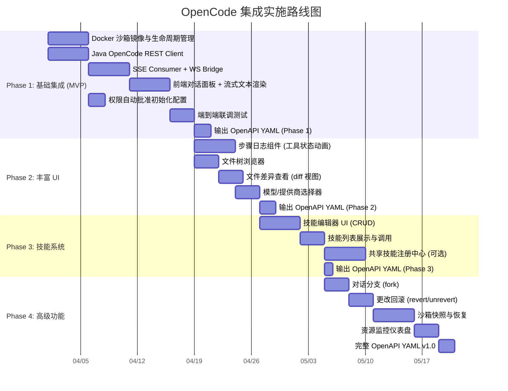

---

## 附录：快速验证步骤

```bash
# 1. 本地启动 opencode 无头服务
cd packages/opencode
bun dev serve --port 4096

# 2. 验证 SSE 事件流格式
curl -N http://localhost:4096/event

# 3. 测试会话创建
curl -X POST http://localhost:4096/session/ \
  -H "Content-Type: application/json" \
  -d '{}'

# 4. 测试异步 prompt
curl -X POST http://localhost:4096/session/{SESSION_ID}/prompt_async \
  -H "Content-Type: application/json" \
  -d '{"parts":[{"type":"text","text":"hello, what can you do?"}]}'

# 5. 验证 Docker 沙箱镜像
docker build -f integration/sandbox/Dockerfile -t opencode-sandbox .
docker run -p 4096:4096 \
  -e OPENCODE_SERVER_PASSWORD=test123 \
  -e ANTHROPIC_API_KEY=$ANTHROPIC_API_KEY \
  opencode-sandbox
```
